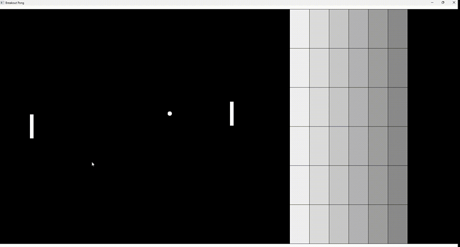

# Breakout Pong

## Description

The games Breakout and Pong combined. The goal is to bounce the ball off the right side of the screen while preventing it from bouncing off the left side. There is a simple AI-controlled paddle and multiple tiles opposing the player. The game is over when the ball hits either side of the screen.

Created by building upon the Pong tutorial in the book "Game Programming in C++: Creating 3D Games" by Sanjay Madhav. Utilizes the SDL2 library for rendering and input handling.

## Controls

- Up and down arrows to move the paddle
- `P` to pause the game

## Features

- Ball speed increases with each tile hit
- AI paddle dodges the ball when bouncing off of tiles

## Things I was too lazy to do

- Remove magic numbers to ensure compatibility with different screen resolutions
- Implement a proper game over screen & restart button

## Quick start guide

See the releases section or click [here](https://github.com/MJKagone/Breakout-Pong/releases/latest). Download the zip file and extract the contents. Run `breakoutpong.exe`.
